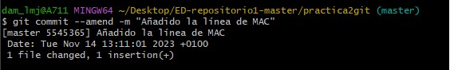

# Practica 2 - GIT

1. Cread un repositorio (directorio) llamado practica2git e inicializa el sistema de control de versiones


2. Cread un fichero llamado contenido.txt con el siguiente texto:
```
- Introducción a linea de comandos
    - Windows
    - Linux
```


3. Comprobad el estado del repositorio


4. Añadid el fichero a la zona de preparado (ver ej5)
5. Comprobad de nuevo el estado del repositorio


6. Haced el primer commit con su comentario correspondiente


7. Añadid la línea al fichero:
```
- Mac
``` 


8. Compruebad de nuevo el estado del repositorio (ver ej10)
9. Añadid el fichero a preparado (ver ej10)
10. Haced otro commit del fichero (ver ej10)


11. Cambiad el mensaje del último commit por “Añadido la línea de MAC.”
```
Para cambiar el mensaje del commit se usa:

$git commit --amend -m "Mensaje"

```




https://github.com/juanvi1921/Pr2t3ED.git


